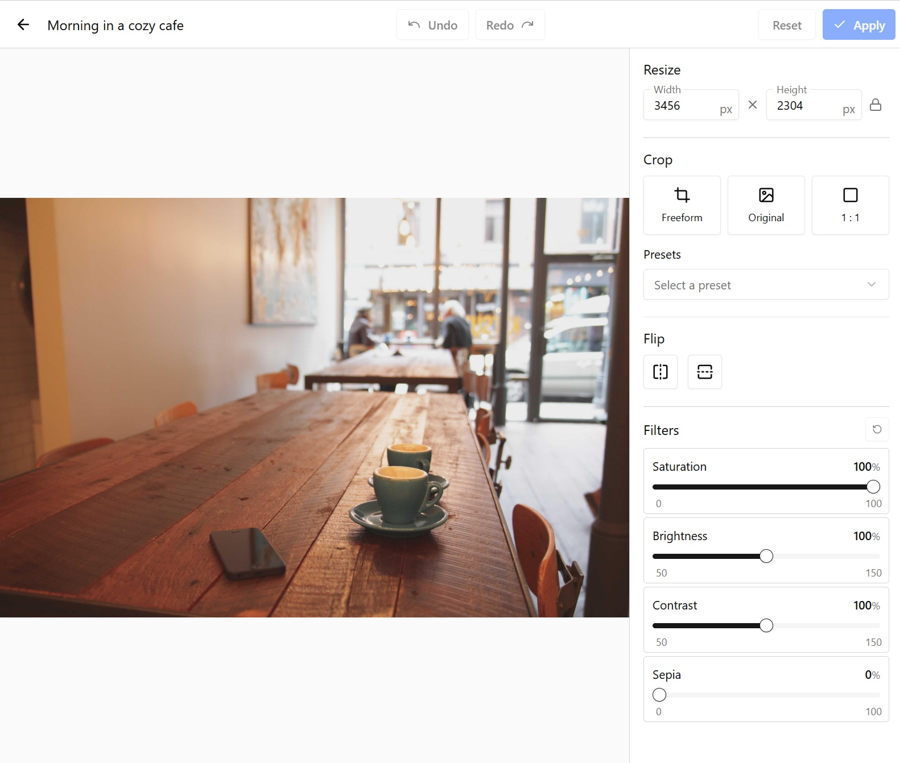
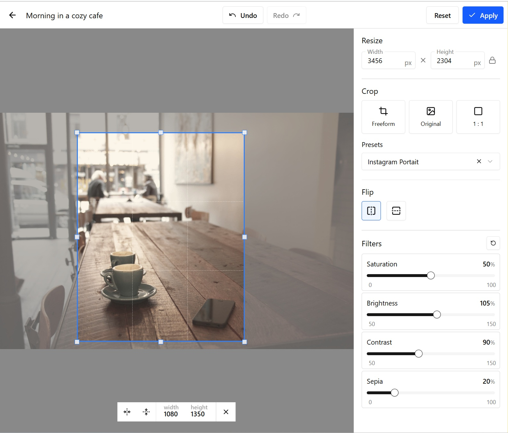
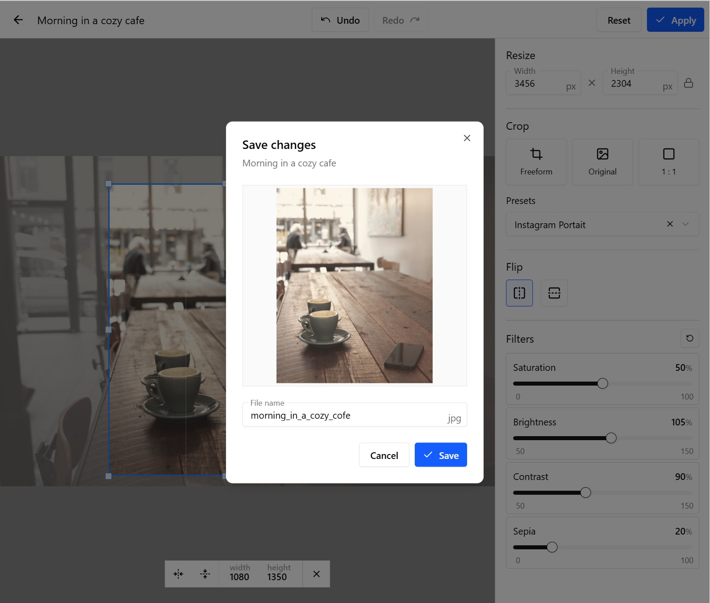

# e-Commerce admin panel

This is an example of a simple image editor, based on Vite, React 19, Typescript, Shadcn UI, Tailwind.

### Installing and starting the application:

1. Open the project in your IDE

2. install all dependencies

```bash
npm install
```

3. run project

```bash
npm run dev
```

Open in you browser `http://localhost:5173`. If you want to change the port open `package.json` and change the number to `vite --port [new_number]`

## Editor tools

1. Resize the original image
2. Crop
3. Flip: horizontal and vertical
4. Applying filters: Saturation, Brightness, Contrast, Sepia
5. History of your actions

## Sreenshots





